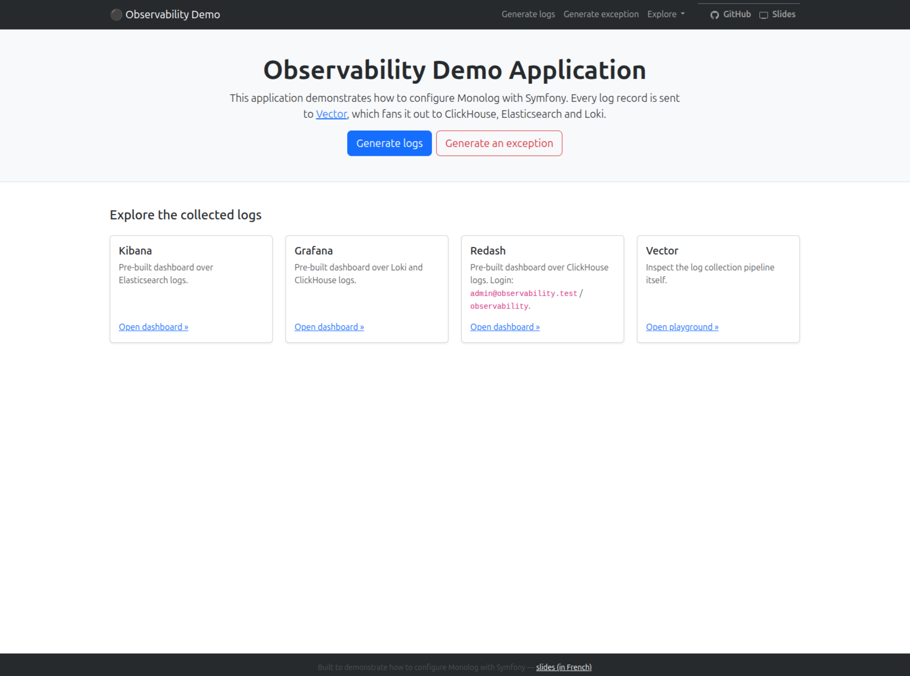
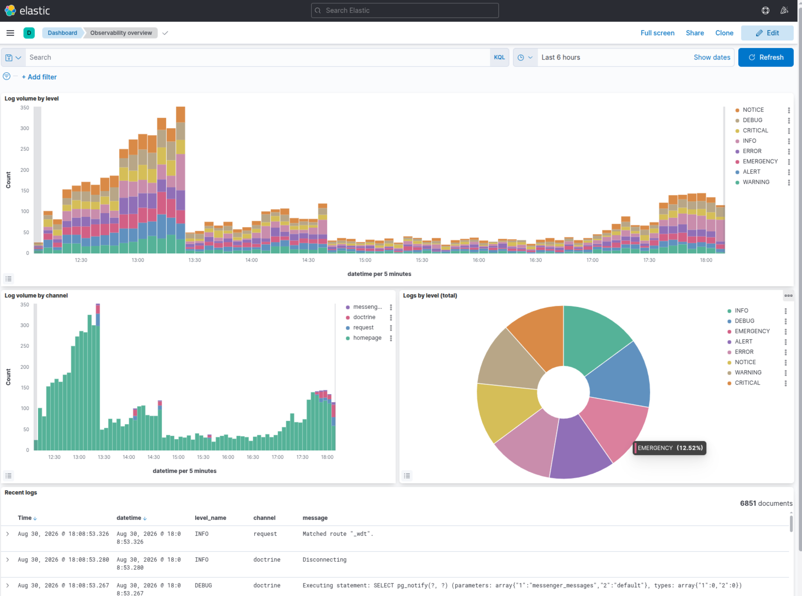
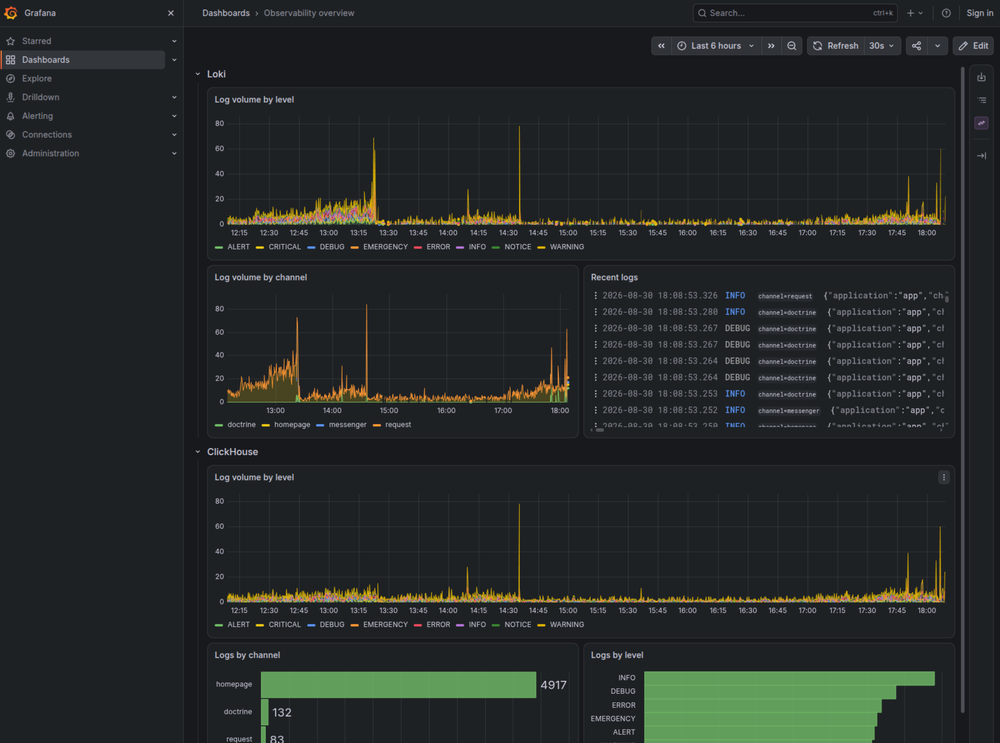
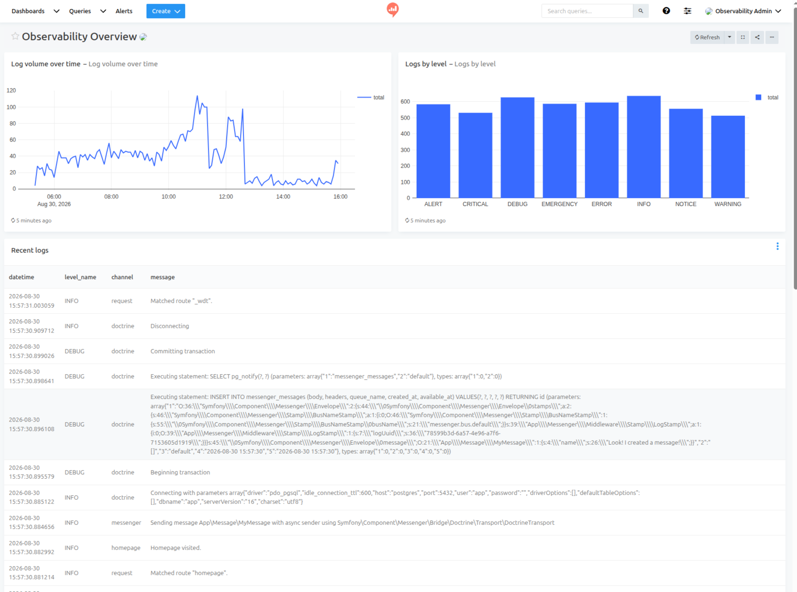

# Symfony Demo — Observability & Logging

A small Symfony application built to demonstrate how to properly configure
[Monolog](https://github.com/Seldaek/monolog), and what a real observability
stack around it looks like in practice. Read the
[slides (in French)](https://s.lyrixx.info/log) for the full story.

Every log record is sent to [Vector](https://vector.dev/), which fans it out
to **ClickHouse**, **Elasticsearch** and **Loki** — each explorable through
its own tool (**Redash**, **Kibana**, **Grafana**), pre-provisioned with a
dashboard so there's real data to look at from the very first click.



## Running the application locally

### Requirements

A Docker environment is provided and requires you to have these tools available:

 * Docker
 * [Castor](https://github.com/jolicode/castor#installation)

### Docker environment

The Docker infrastructure provides:

 - nginx + PHP 8.5, running Symfony 8.1 (Bootstrap frontend via AssetMapper, no Node needed)
 - PostgreSQL
 - [Vector](https://vector.dev/), collecting every log record and shipping it to:
   - Elasticsearch + Kibana
   - Loki + Grafana
   - ClickHouse + Redash
 - Traefik
 - A `builder` container with Composer and the QA tooling

### Domain configuration (first time only)

Before running the application for the first time, ensure your domain names
point the IP of your Docker daemon by editing your `/etc/hosts` file.

This IP is probably `127.0.0.1` unless you run Docker in a special VM (like docker-machine for example).

> [!NOTE]
> The router binds port 80 and 443, that's why it will work with `127.0.0.1`

```
echo '127.0.0.1 observability.test clickhouse.observability.test elasticsearch.observability.test grafana.observability.test kibana.observability.test loki.observability.test redash.observability.test vector.observability.test ' | sudo tee -a /etc/hosts
```

### Starting the stack

Launch the stack by running this command:

```bash
castor start
```

> [!NOTE]
> the first start of the stack should take a few minutes.

The site is now accessible at https://observability.test (you may need to accept
self-signed SSL certificate if you do not have mkcert installed on your computer
- see below).

`castor start` also provisions a dashboard in Kibana, Grafana and Redash, so
the "Explore" links on the homepage show real data right away instead of an
empty tool. Grafana and Kibana need no login; Redash does, with
`admin@observability.test` / `observability`.

To fill the dashboards, use the "Generate logs" button and pick a tempo
(right now, the last 30 minutes, the last hour, or the last 6 hours) — logs
are backdated and spread across the chosen window instead of landing all at
once, so the dashboards show something realistic immediately.

### Other tasks

Checkout `castor` to have the list of available tasks. For AI coding agents
working in this repo, see [AGENTS.md](AGENTS.md).

## Screenshots

### Kibana



### Grafana



### Redash


